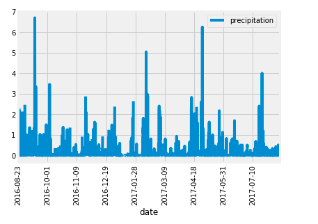
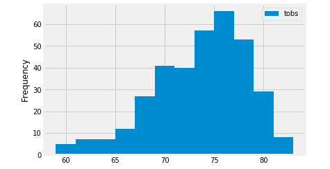

# surfs_up

## Overview

The purpose of this analysis was to find the most activate stations and provide weather data to find the best location for the surf shop. 

## Results

Percipitation by Day       |  Temperature by Year
:-------------------------:|:-------------------------:
      |  

- On average the percipitation levels are about 0.7
- The most active station is USC00519281
- Based on the most activate station, we can see that the temperature is above 67 degreess most of the year
---

## Summary 

Oahu has rain but not so much that it ruins surfing making it an ideal place. The most active station is a good location because the temperatures are pretty warm on average.
